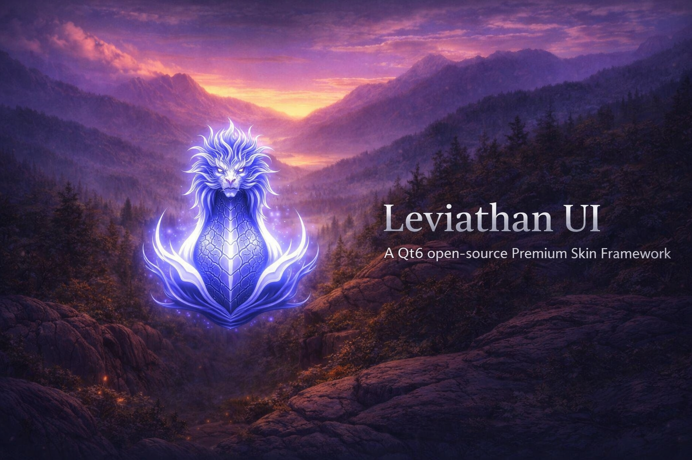

# 🐉 Leviathan-UI v1.0.4



**Framework premium de PyQt6 para aplicaciones modernas con estilo Windows 11**

---

## 🚀 Novedades en esta versión

### Instalador Profesional Leviathan-UI Setup
- **UI completamente rediseñada**: Instalador estilo NSIS con banners y transiciones pulidas
- **Banner vertical de bienvenida**: `assets/splash_setup.png` como banner lateral izquierdo
- **Opciones avanzadas**: Modo local/remoto, accesos directos, opciones de reinstalación
- **Banner superior en instalación**: `assets/splash.png` durante el proceso
- **Prevención de múltiples instancias**: Usa `QSharedMemory`
- **Worker thread**: Instalación en segundo plano sin bloquear UI

### Correcciones PyQt6
- Compatibilidad completa con PyQt6 (`Qt.AlignmentFlag.AlignCenter`)
- API de locale moderna (`locale.getlocale()` para Python 3.11+)
- Método `exec()` actualizado (sintaxis PyQt6)
- Todos los scripts de demo funcionales

### Mejoras Visuales
- `CustomTitleBar` con fondo transparente
- Fondos transparentes en controles de packagemaker
- Mejor integración visual entre componentes

---

## 📦 Instalación

### Opción 1: PyPI (Recomendado)
```bash
pip install leviathan-ui
```

### Opción 2: Instalador local
1. Descarga el archivo `.whl` desde Assets abajo
2. Ejecuta: `pip install leviathan_ui-1.0.4-py3-none-any.whl`

### Opción 3: Instalador GUI
Ejecuta `leviathan-ui.py` para el instalador gráfico interactivo.

---

## 📚 Documentación
- [README](https://github.com/JesusQuijada34/leviathan-ui#readme)
- [FAQ](https://github.com/JesusQuijada34/leviathan-ui/blob/main/docs/faq.md)
- [Reportar Issues](https://github.com/JesusQuijada34/leviathan-ui/issues)

---

## 🛠️ Requisitos
- Python 3.8+
- PyQt6 6.5+
- Windows 10/11 (recomendado)

---

**Versión**: v1.0.4  
**Fecha**: 2026-04-07  
**Autor**: Jesus Quijada (@JesusQuijada34)
